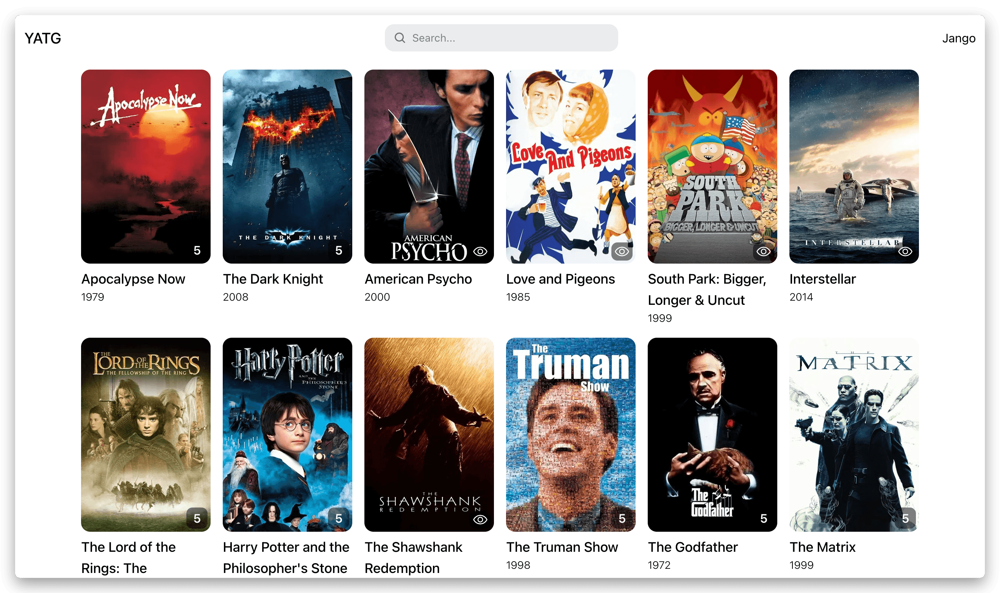
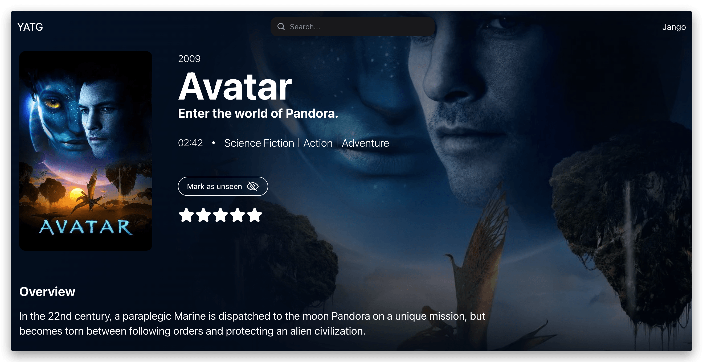
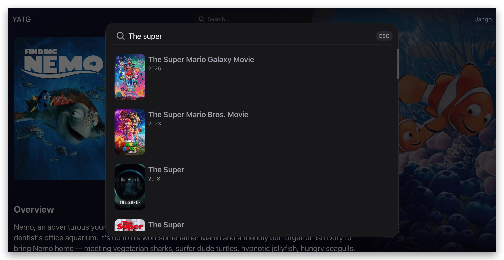

# 🎬 Movie Tracker

A full-stack watchlist app for discovering and tracking movies — built with NestJS, Next.js, and PostgreSQL.

### [Preview](https://yatg.vercel.app/)

---

## Tech Stack

**Backend**
- [NestJS 11](https://nestjs.com) on [Fastify](https://fastify.dev)
- [Drizzle ORM](https://orm.drizzle.team) with [PostgreSQL](https://www.postgresql.org) ([Neon](https://neon.tech))
- JWT auth (access + refresh tokens) via Passport.js
- [bcrypt](https://github.com/kelektiv/node.bcrypt.js) for password hashing · [cuid2](https://github.com/paralleldrive/cuid2) for IDs
- Scheduled jobs via `@nestjs/schedule`
- OpenAPI/Swagger docs

**Frontend**
- [Next.js 16](https://nextjs.org) (App Router) with React 19
- [HeroUI](https://www.heroui.com) component library · [Tailwind CSS v4](https://tailwindcss.com)
- [TanStack Query v5](https://tanstack.com/query) for data fetching & caching
- Web Worker for background color palette extraction from posters

**Shared**
- `packages/api-types` — shared TypeScript request/response contracts (pnpm workspace)

**External services**
- [TMDB API](https://www.themoviedb.org/documentation/api) — movie search & metadata
- [HaveIBeenPwned Passwords](https://haveibeenpwned.com/API/v3#PwnedPasswords) — password breach detection at signup

**Deployment**
- Backend → [Render](https://render.com)
- Frontend → [Vercel](https://vercel.com)
- Database → [Neon](https://neon.tech)

---

## Architecture

```
.
├── packages/
│   └── api-types/          # Shared request/response TypeScript types
├── backend/                # NestJS API
│   ├── src/modules/api/    # Feature modules (auth, movies, sessions, user-movies)
│   ├── src/modules/tmdb/   # TMDB integration
│   ├── src/modules/cron/   # Scheduled jobs (e.g. expired session cleanup)
│   └── src/db/             # Drizzle schema & migrations
└── frontend/               # Next.js app (BFF + UI)
    └── src/
        ├── app/api/        # BFF proxy routes
        ├── entities/       # Data-fetching layer (movies, user-movies, me)
        ├── features/       # User interactions (search, auth forms)
        ├── widgets/        # Composed UI sections (app bar, movie details)
        └── shared/         # UI primitives, hooks, API client
```

The frontend acts as a **BFF (Backend for Frontend)** — all API calls from the browser are proxied through Next.js route handlers, keeping backend URLs and tokens server-side.

The `packages/api-types` workspace package is shared between backend and frontend to keep request/response contracts in sync.

---

## Database Schema

```
users
  id · username · password · createdAt · updatedAt

user_sessions
  id · userId → users · refreshTokenId · accessTokenId
  expiresAt · lastUsedAt · createdAt

movies                        ← TMDB data cache
  id (tmdb id) · title · originalTitle
  posterPath · releaseDate · cachedAt

user_movies
  id · userId → users · movieId → movies
  rating (1–5, nullable) · watchedAt (nullable)
  createdAt · updatedAt
  UNIQUE (userId, movieId)
```

Movies are cached locally from TMDB on first access. User-movie entries support optional rating (1–5) and watch date.

---

## Features

- 🔐 JWT auth with access & refresh tokens, multi-session support
- 🔍 Movie search powered by TMDB
- 📋 Personal watchlist — add, rate, and track watched movies
- 🛡️ Password breach detection via HaveIBeenPwned at signup
- 🎨 Dynamic background palette generated from movie posters (Web Worker)

## Preview



